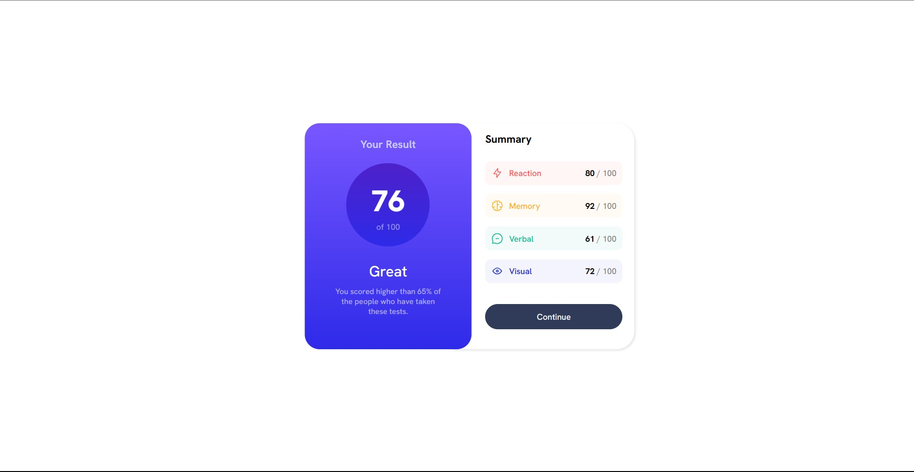
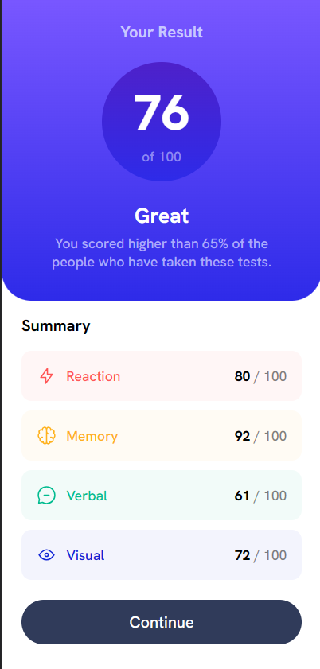

# Frontend Mentor - Results summary component solution

This is a solution to the [Results summary component challenge on Frontend Mentor](https://www.frontendmentor.io/challenges/results-summary-component-CE_K6s0maV). Frontend Mentor challenges help you improve your coding skills by building realistic projects. 

## Table of contents

- [Overview](#overview)
  - [The challenge](#the-challenge)
  - [Screenshot](#screenshot)
  - [Links](#links)
- [My process](#my-process)
  - [Built with](#built-with)
  - [What I learned](#what-i-learned)
  - [Continued development](#continued-development)
  - [Useful resources](#useful-resources)
- [Author](#author)

## Overview

The following project showcases a result summary design that effectively presents results from various categories while also displaying the average result.

### The challenge

Users should be able to:

- View the optimal layout for the interface depending on their device's screen size
- See hover and focus states for all interactive elements on the page

### Screenshots
#### Desktop

#### Mobile

### Links

- Solution URL: [My solution](https://github.com/HectorAgValenzuela/results-summary-component)
- Live Site URL: [Live solution](https://your-live-site-url.com)

## My process

### Built with

- Semantic HTML5 markup
- CSS custom properties
- Flexbox
- Mobile-first workflow

### What I learned

In this project I used it and realized its usefulness when structuring the skeleton of the project.

I learned to utilize the media queries a better way.

### Continued development

I utilized flexbox and familiarized myself with the parent-child structure to create a well-structured layout for the project.

### Useful resources

- [Responsive Web Design - Media Queries](https://www.w3schools.com/css/css_rwd_mediaqueries.asp) - This helped me to understand the media queries
- [JSON HTML](https://www.w3schools.com/js/js_json_html.asp) - This helped me for understanding how to effectively utilize JSON files within an HTML context.
- [A Complete Guide to Flexbox](https://css-tricks.com/snippets/css/a-guide-to-flexbox/) - Awesome article that helped me undertand flexbox

## Author

- Frontend Mentor - [@HectorAgValenzuela](https://www.frontendmentor.io/profile/HectorAgValenzuela)
- Twitter - [@DINO_3_14](https://twitter.com/DINO_3_14)
